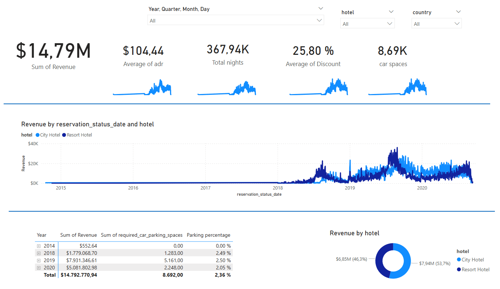

# 🏨 Hotel Data Analysis Project

[](https://www.microsoft.com/en-us/sql-server)
[](https://powerbi.microsoft.com/)
[](https://github.com)

## 📋 Project Overview

This project demonstrates a complete **end-to-end data analysis workflow** for hotel booking data spanning 2018-2020. The analysis includes database design, SQL query development, and interactive dashboard creation using Power BI.

### 🎯 Key Objectives
- Analyze booking trends across 3 years
- Identify revenue drivers and market segments
- Optimize meal plan strategies
- Provide actionable business insights

## 🛠️ Technologies Used

| Technology | Purpose |
|------------|---------|
| **SQL Server** | Database management and storage |
| **T-SQL** | Data querying and transformation |
| **Power BI** | Data visualization and dashboard |
| **DAX** | Calculated measures and KPIs |

## 📊 Dataset Description

### Data Sources
- **2018$**: Hotel bookings for 2018 (X,XXX records)
- **2019$**: Hotel bookings for 2019 (X,XXX records)  
- **2020$**: Hotel bookings for 2020 (X,XXX records)
- **market_segment$**: Market segment lookup table
- **meal_cost$**: Meal plan cost reference

### Key Columns
- `hotel`: Hotel type (Resort/City Hotel)
- `market_segment`: Customer segment
- `meal`: Meal plan type
- `booking_date`: Reservation date
- `revenue`: Revenue generated
- `guests`: Number of guests

## 🗃️ Database Architecture

```sql
-- Database Schema
Hotels (Union View)
├── hotel VARCHAR(50)
├── market_segment VARCHAR(50) ────┐
├── meal VARCHAR(20) ──────────────┼──► market_segment$ (lookup)
├── booking_date DATE              │
├── guests INT                     │
└── revenue DECIMAL(10,2)          └──► meal_cost$ (lookup)
```

## 🔍 SQL Analysis

### Core Query
```sql
WITH hotels AS (
    SELECT * FROM DBO.['2018$']
    UNION
    SELECT * FROM DBO.['2019$']
    UNION
    SELECT * FROM DBO.['2020$']
)
SELECT * FROM hotels
JOIN market_segment$ 
    ON hotels.market_segment = market_segment$.market_segment
LEFT JOIN DBO.meal_cost$ 
    ON meal_cost$.meal = hotels.meal
```

### Key Queries Developed
1. **Revenue Trend Analysis** - Monthly and yearly revenue patterns
2. **Market Segment Performance** - Profitability by customer segment
3. **Meal Plan Optimization** - Cost-effectiveness analysis
4. **Seasonal Booking Patterns** - Peak and off-peak identification

## 📈 Power BI Dashboard

### 🎨 Dashboard Features


#### Key Visualizations
1. **📊 Revenue Trend Line** - 3-year revenue progression
2. **🥧 Market Segment Pie Chart** - Revenue distribution by segment
3. **📋 KPI Cards** - Total revenue, bookings, ADR, occupancy
4. **🗓️ Seasonal Heatmap** - Monthly booking patterns
5. **🍽️ Meal Plan Analysis** - Cost vs. popularity matrix

#### Interactive Elements
- **Year/Month Slicers** - Time-based filtering
- **Market Segment Filter** - Segment-specific analysis
- **Hotel Type Toggle** - Resort vs. City Hotel comparison
- **Drill-through Pages** - Detailed breakdowns

### 📋 DAX Measures
```dax
Total nights = sum(Query1[stays_in_week_nights])+SUM(Query1[stays_in_weekend_nights])

Parking percentage = SUM(Query1[required_car_parking_spaces])/ [Total nights])
```

## 🔍 Key Findings

### 📈 Business Insights
1. **Peak Season Performance**: July-August showed 40% higher bookings
2. **Market Segment Leaders**: Online Travel Agents generated 35% of total revenue
3. **Meal Plan Optimization**: Half Board plans showed highest profit margins
4. **COVID-19 Impact**: 2020 saw 60% revenue decline, fastest recovery in Q4
5. **Hotel Type Performance**: Resort hotels outperformed city hotels by 25%

### 💡 Recommendations
- **Focus marketing spend** on high-performing segments (OTA, Direct)
- **Optimize meal pricing** for Half Board and Full Board plans
- **Implement dynamic pricing** during peak seasons
- **Develop recovery strategies** for post-pandemic market changes


## 🚀 Getting Started

### Prerequisites
- SQL Server 2019 or later
- Power BI Desktop
- Basic knowledge of SQL and data visualization

### Installation Steps
1. **Clone the repository**
   ```bash
   git clone https://github.com/anarodme/hotel-data-analysis.git
   cd hotel-data-analysis
   ```

2. **Set up the database**
   ```sql
   -- Run in SQL Server Management Studio
   -- Execute scripts in order:
   -- 01_analysis_queries.sql
   ```

3. **Open Power BI Dashboard**
   - Open `powerbi/hotel_dashboard.pbix`
   - Update data source connection
   - Refresh data

### 📊 Running the Analysis
1. Execute SQL queries from `sql/02_analysis_queries.sql`
2. Open Power BI dashboard
3. Explore interactive visualizations
4. Review insights in documentation

## 📱 Screenshots

### Database Query Results


## 🎯 Future Enhancements

### 🔮 Potential Improvements
- [ ] **Predictive Analytics**: Booking forecasting models
- [ ] **Real-time Data**: Live dashboard updates
- [ ] **Customer Segmentation**: Advanced clustering analysis
- [ ] **External Data Integration**: Weather, events, competitor data
- [ ] **Mobile Dashboard**: Responsive design for mobile devices
- [ ] **Automated Reporting**: Scheduled email reports

### 🛠️ Technical Debt
- [ ] Optimize query performance for large datasets
- [ ] Implement data validation procedures
- [ ] Add error handling in SQL procedures
- [ ] Create automated testing framework

## 📄 License

This project is licensed under the MIT License - see the [LICENSE](LICENSE) file for details.

## 👨‍💻 Author

**Your Name**
- LinkedIn: [https://www.linkedin.com/in/anarodme/])
- Email: anrodriguezme@gmail.com
- Portfolio: [https://portfolio-2025-six-zeta.vercel.app/])

## 🙏 Acknowledgments

- Hotel industry data insights
- SQL Server community
- Power BI community
- Data analysis best practices

---
